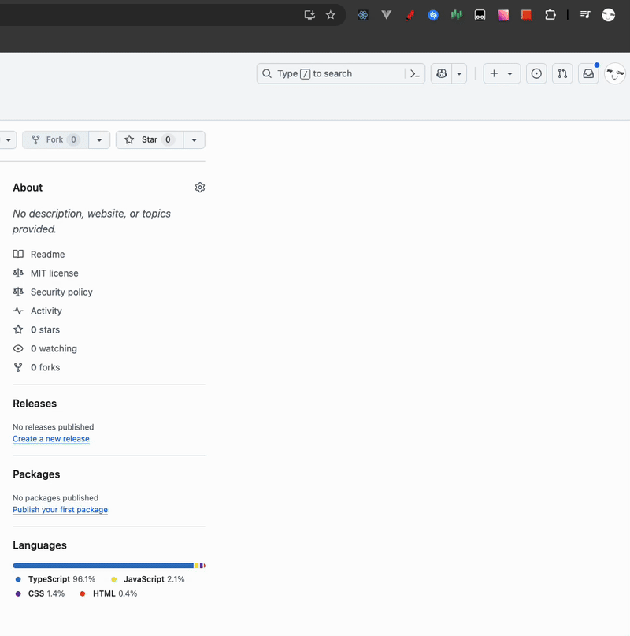

# Pixel Perfect - Бесплатное расширение для браузера

[](https://github.com/cairon666/pixel-perfect-free-extension/actions/workflows/ci.yml)
[](https://opensource.org/licenses/MIT)

## Описание

**Pixel Perfect** — современное браузерное расширение для веб-разработчиков, позволяющее в режиме реального времени сравнивать макеты дизайна с реализованными интерфейсами. Расширение помогает достичь pixel-perfect точности при верстке, значительно ускоряя процесс разработки и повышая качество пользовательских интерфейсов.



## Актуальность и проблематика

### Проблемы, которые решает расширение:

- **Неточность верстки**: Разработчики тратят много времени на ручное сравнение макетов с реализацией
- **Отсутствие удобных инструментов**: Существующие решения часто платные или имеют ограниченную функциональность
- **Потеря времени**: Переключение между дизайн-макетом и браузером замедляет рабочий процесс
- **Субъективная оценка**: Сложность точной оценки соответствия макету "на глаз"

### Экономия ресурсов:

- **Время разработки**: Сокращение времени на верстку до 40%
- **Качество кода**: Снижение количества итераций с дизайнерами
- **Производительность команды**: Ускорение процесса код-ревью интерфейсов

## Возможности

- 🎯 **Pixel-perfect наложение** изображений поверх веб-страниц
- 🔧 **Гибкая настройка**: прозрачность, масштабирование, позиционирование
- 📋 **Поддержка Drag & Drop** и вставки из буфера обмена
- 🔒 **Режим блокировки** для предотвращения случайных изменений
- 📊 **Diff-режим** для выявления различий
- 💾 **Автосохранение** позиций и настроек изображений

## Быстрый старт

### Установка из исходного кода

1. **Клонируйте репозиторий:**

   ```bash
   git clone https://github.com/cairon666/pixel-perfect-free-extension
   cd pixel-perfect-free-extension
   ```

2. **Установите зависимости:**

   ```bash
   npm install
   ```

3. **Соберите расширение:**

   ```bash
   npm run build
   ```

4. **Загрузите в браузер:**
   - Откройте Chrome/Edge: `chrome://extensions/`
   - Включите "Режим разработчика"
   - Нажмите "Загрузить распакованное расширение"
   - Выберите папку `dist`

### Быстрая разработка

```bash
# Запуск в режиме разработки
npm run dev

# Сборка для разработки (без минификации)
npm run build:dev

# Запуск тестов
npm test
```

## Использование

### Базовое использование

1. **Откройте веб-страницу** для верстки
2. **Нажмите на иконку расширения** в панели браузера
3. **Загрузите изображение макета**
4. **Настройте параметры наложения:**
   - Отрегулируйте прозрачность
   - Измените масштаб и позицию
   - Используйте режим блокировки при необходимости

### Продвинутые возможности

#### Режимы работы

- **Обычный режим**: Стандартное наложение с настраиваемой прозрачностью
- **Diff-режим**: Выделение различий между макетом и реализацией
- **Блокировка**: Фиксация позиции для предотвращения случайных изменений
- **Центрирование**: Автоматическое выравнивание по центру экрана

## Архитектура

### Технологический стек

- **Frontend**: React 18, TypeScript 5.3+
- **UI**: Tailwind CSS, Radix UI
- **State Management**: Reatom
- **Build System**: Vite
- **Testing**: Vitest, Testing Library
- **Code Quality**: ESLint, Prettier, Lefthook

## Требования и ограничения

### Системные требования

- **Браузеры**: Chrome 88+, Edge 88+, Firefox 109+ (с адаптацией)
- **Операционные системы**: Windows 10+, macOS 10.14+, Linux (Ubuntu 18.04+)
- **Память**: Минимум 4GB RAM (рекомендуется 8GB+)

### Ограничения

- Максимальный размер изображения: 50MB
- Поддерживаемые форматы: PNG, JPG, JPEG, GIF, WebP, SVG
- Некоторые сайты с строгой CSP могут ограничивать функциональность
- Не работает на внутренних страницах браузера (`chrome://`, `edge://`)

### Совместимость

- ✅ Большинство веб-сайтов
- ✅ Локальные HTML файлы
- ✅ Веб-приложения (SPA)
- ❌ Страницы браузера (`chrome://extensions`)
- ❌ Chrome Web Store
- ⚠️ Сайты с строгой Content Security Policy (ограниченная функциональность)

## Разработка

### Настройка окружения разработки

```bash
# Клонирование и установка
git clone https://github.com/cairon666/pixel-perfect-free-extension
cd pixel-perfect-free-extension
npm install

```

### Структура команд

```bash
# Сборка
npm run build           # Продакшн сборка
npm run build:dev       # Девелопмент сборка

# Тестирование
npm test               # Запуск тестов
npm run test:watch     # Тесты в watch режиме

# Качество кода
npm run lint           # Проверка ESLint
npm run format         # Форматирование Prettier
npm run tsc            # Проверка TypeScript

# Анализ бандла
npm run analyze        # Анализ размера бандла
```

## Инструкция пользователя

### Первое использование

1. **Установите расширение** в браузер
2. **Откройте веб-страницу**, которую нужно сверить с макетом
3. **Кликните на иконку расширения** в панели инструментов
4. **Загрузите изображение макета** одним из способов:
   - Перетащите файл в область загрузки
   - Нажмите "Выбрать файл" и выберите изображение
   - Нажмите кнопку "Вставить" в меню расширения для вставки из буфера обмена

### Настройка наложения

1. **Прозрачность**: Используйте слайдер для настройки видимости макета
2. **Позиционирование**: Перетащите изображение в нужное место
3. **Масштабирование**: Используйте элементы управления
4. **Блокировка**: Активируйте для фиксации позиции

### Продвинутые функции

- **Diff-режим**: Подсвечивает различия между макетом и реализацией
- **Центрирование**: Автоматически центрирует макет по экрану
- **Сохранение состояния**: Позиции и настройки сохраняются автоматически

## Лицензия

Проект распространяется под лицензией [MIT](LICENSE). Это означает, что вы можете свободно использовать, модифицировать и распространять код в коммерческих и некоммерческих целях.
